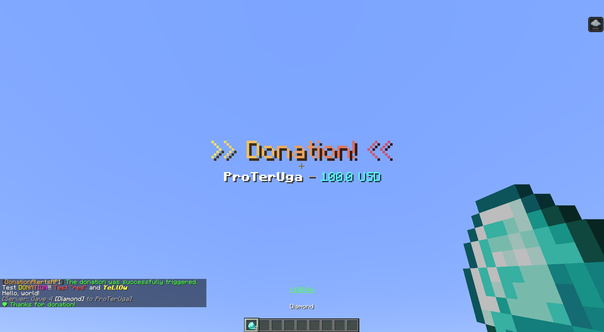

# DonationAlertsAPI

[](https://papermc.io/)
[](https://adoptium.net/)
[](https://modrinth.com/plugin/donationalertsapi)
[](https://github.com/ProTerUga/DonationAlertsAPI/blob/master/LICENSE)
[](https://github.com/ProTerUga/DonationAlertsAPI/releases)

**DonationAlertsAPI** is a modern, high-performance Minecraft plugin that allows you to receive real-time donation alerts directly from the [DonationAlerts](https://www.donationalerts.com/) platform in your game.

The plugin connects to the DonationAlerts WebSocket API and fires custom events within the server, enabling seamless integration with other plugins for various use cases (e.g., announcing donations, giving rewards, executing commands).

---

## Features

- **Real-time** - Receives donation alerts instantly via DonationAlerts WebSocket.
- **Custom event** - Fires a custom `DonationEvent` that can be listened to by any other plugin.
- **Easy configuration** - All settings are managed via a simple `config.yml` file and command `/daapi auth` to easily obtain an access-key.
- **Reload command** - Reload configuration without restarting the server (`/daapi reload`).
- **MiniMessage** - Native support for MiniMessage is built into the plugin.
- **PlaceholderAPI** - PlaceholderAPI support in built-in commands.
- **Donation actions** - Customizable commands that will be executed when a donation is received.


---

## Installation

1. Download the latest JAR file from the [Releases](https://github.com/ProTerUga/DonationAlertsAPI/releases) page or from [Modrinth](https://modrinth.com/plugin/donationalertsapi).
2. Place the `DonationAlertsAPI-*.jar` file into the `plugins` folder of your Paper server.
3. Start (or restart) the server to generate the default configuration.
4. Edit the `plugins/DonationAlertsAPI/config.yml` with your DonationAlerts account details (see [Configuration](https://github.com/ProTerUga/DonationAlertsAPI/wiki/Configuration) for more information).
5. Reload the plugin with `/daapi reload` or restart the server again.

---

## Maven Dependency (for Developers)

If you want to use `DonationAlertsAPI` as a dependency in your own plugin, you can include it via **JitPack** - a build service for GitHub repositories.

### 1. Add the JitPack repository

**Maven** (`pom.xml`):
```xml
<repositories>
    <repository>
        <id>jitpack.io</id>
        <url>https://jitpack.io</url>
    </repository>
</repositories>
```
**Gradle** (`build.gradle`):
```gradle
repositories {
    maven { url 'https://jitpack.io' }
}
```

### 2. Add the dependency
Replace `VERSION` with the latest release tag.

**Maven** (`pom.xml`):
```xml
<dependency>
    <groupId>com.github.ProTerUga</groupId>
    <artifactId>DonationAlertsAPI</artifactId>
    <version>VERSION</version>
    <scope>provided</scope>
</dependency>
```
**Gradle** (`build.gradle`):
```gradle
dependencies {
    compileOnly 'com.github.ProTerUga:DonationAlertsAPI:VERSION'
}
```

### Example Usage in Another Plugin

```java
@EventHandler
public void onDonation(DonationEvent event) {
    String sender = event.getUsername();
    double amount = event.getAmount();
    String currency = event.getCurrency();
    String message = event.getMessage();

    Bukkit.broadcastMessage("§a" + sender + " donated " + amount + " " + currency + "!");
}
```
> Note: You need to depend on DonationAlertsAPI in your plugin.yml:
```yaml
depend: [DonationAlertsAPI]
```
---
## Dependencies

- [Paper API](https://papermc.io/) 1.18.2+
- [Java-WebSocket](https://github.com/TooTallNate/Java-WebSocket) 1.5.3+
- [Gson](https://github.com/google/gson) 2.10.1+
