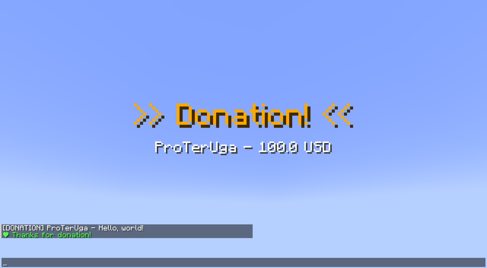

# DonationAlertsAPI

[](https://papermc.io/)
[](https://adoptium.net/)
[](https://modrinth.com/plugin/donationalertsapi) <!-- Замените ссылку после публикации -->

**DonationAlertsAPI** is a modern, high-performance Minecraft plugin that allows you to receive real-time donation alerts directly from the [DonationAlerts](https://www.donationalerts.com/) platform in your game.

The plugin connects to the DonationAlerts WebSocket API and fires custom events within the server, enabling seamless integration with other plugins for various use cases (e.g., announcing donations, giving rewards, executing commands).

---

## ✨ Features

- **Real-time** - Receives donation alerts instantly via DonationAlerts WebSocket.
- **Custom event** - Fires a custom `DonationEvent` that can be listened to by any other plugin.
- **Easy configuration** - All settings are managed via a simple `config.yml` file.
- **Reload command** - Reload configuration without restarting the server (`/daapi reload`).
- **Paper-compatible** - Designed for Paper 1.21.1+
- **MiniMessage** - Native support for MiniMessage is built into the plugin.



---

## 📥 Installation

1. Download the latest JAR file from the [Releases](https://github.com/ProTerUga/DonationAlertsAPI/releases) page or from [Modrinth](https://modrinth.com/plugin/donationalertsapi).
2. Place the `DonationAlertsAPI-*.jar` file into the `plugins` folder of your Paper server.
3. Start (or restart) the server to generate the default configuration.
4. Edit the `plugins/DonationAlertsAPI/config.yml` with your DonationAlerts account details (see Configuration below).
5. Reload the plugin with `/daapi reload` or restart the server again.

---

## ⚙️ Configuration

The `config.yml` file is auto-generated upon first start. Below are the available options:

```yaml
# ──────────────────────────────────────────────────────────────────────────────
# DonationAlertsAPI Plugin Configuration
# ──────────────────────────────────────────────────────────────────────────────

# Your DonationAlerts OAuth2 access token.
# Obtain it via the authorization code flow:
# https://www.donationalerts.com/apidoc#authorization__authorization_code
#
# REQUIRED. The plugin won't work without it.
# Step-by-step guide you can find here:
# https://github.com/ProTerUga/DonationAlertsAPI/wiki/Obtaining-access%E2%80%90token
access-token: ""


# These parameters are needed to easily obtain an access token.
# If you already have one and/or you know what to do,
# you don't have to fill in these fields.

# Your OAuth2 application's App ID.
client-id: ""
# Your OAuth2 application's API Key (Client Secret). Keep this private!
client-secret: ""
# The redirect URL configured in your DonationAlerts application.
redirect-uri: http://localhost:8080/callback

# Delay (in seconds) before attempting to reconnect to the Centrifugo WebSocket
# after a disconnection or failure. The plugin will retry indefinitely.
reconnect-delay: 10

# Logging options – control what gets printed to the server console.
log-donations: true          # Log each donation received
log-info: true               # Log connection status, authentication, subscription events
log-web-socket: false        # Log raw WebSocket messages (incoming/outgoing)


# ──────────────────────────────────────────────────────────────────────────────
# Built-in Commands
# ──────────────────────────────────────────────────────────────────────────────
# If you don't want to handle donations via your own code, enable these commands.
# They will run automatically whenever a donation arrives, using the placeholders
# described below. Commands are executed by the console (with full permissions).

enable-builtin-commands: true

# List of commands to execute when a donation is received.
# Available placeholders (case‑sensitive):
#   $sender$   – donor's display name
#   $amount$   – donation amount (numeric)
#   $currency$ – currency code (USD, EUR, RUB, etc.)
#   $message$  – donation message (can be empty)
#
# Each command is a string exactly as you would type it in the console.
# For Minecraft chat/actionbar/title commands, use the appropriate syntax.
commands:
  - title @a title {"text":">> Donation! <<","color":"gold"}
  - title @a subtitle {"text":"$sender$ - $amount$ $currency$"}
  - tellraw @a {"text":"[DONATION] $sender$ - $message$"}
  - playsound minecraft:entity.experience_orb.pickup master @a
  - tellraw $sender$ {"text":"❤ Thanks for donation!","color":"green"}


# ──────────────────────────────────────────────────────────────────────────────
# Messages
# ──────────────────────────────────────────────────────────────────────────────
# All messages sent to players and the console are defined here.
# The plugin uses MiniMessage (Adventure) natively – no legacy color codes (&) are supported.
# You can use any MiniMessage tag: <color>, <gradient>, <bold>, <click>, <hover>, etc.

messages:
  prefix: "<dark_gray>[<gradient:#F2A544:#FFDC80>DonationAlertsAPI</gradient>]</dark_gray> "
  reload:
    successfully-reloaded: "<green>Configuration reloaded!"
    successfully-connected: "<green>Successfully connected to DonationAlerts!"
    reconnect-trying: "<yellow>Reconnecting... Check result in a few seconds."
    missing-token: "<red>Cannot connect: access-token is missing."
    connection-failed: "<red>Connection failed. Check console for errors."
  status:
    connected: "<gray>Connection status: <green>Connected"
    not-connected: "<gray>Connection status: <red>Not connected"
  test:
    connection-warning: "<yellow>Warning! DonationAlerts is NOT connected!"
    donation: "<green>The donation was successfully triggered."
  auth:
    missing-client-id: "<red> Client ID is not set in config.yml. Please set it and reload."
    url-message: '<aqua>Open this URL in your browser and copy an authorization code
          from the search bar (...?code=<code>): <underlined><white><click:open_url:''$url$''><hover:show_text:''Click''>$url$<reset><br>
          <aqua>After that, run at console /daapi token <code>'
  token:
    empty-code: "<red>Code cannot be empty."
    successfully-obtained: "<green>Access token successfully obtained and saved! The plugin will reconnect."
    failed: "<red>Failed to exchange code. Check console for details."


# ──────────────────────────────────────────────────────────────────────────────
# MiniMessage Quick Reference
# ──────────────────────────────────────────────────────────────────────────────
#   <color>         – e.g., <red>, <blue>, <#FF00FF>
#   <gradient>      – e.g., <gradient:#FFCF75:#F07832>text</gradient>
#   <bold>, <italic>, <underlined>, <strikethrough>, <obfuscated>
#   <click:run_command:/command>  – clickable text
#   <hover:show_text:"hover text"> – hover tooltips
#   <reset>          – resets all styling
#
# Full documentation: https://docs.papermc.io/adventure/minimessage/format/
# ──────────────────────────────────────────────────────────────────────────────

debug: false
```
---

## 📦 Maven Dependency (for Developers)

If you want to use `DonationAlertsAPI` as a dependency in your own plugin, you can include it via **JitPack** - a build service for GitHub repositories.

### 1. Add the JitPack repository

**Maven** (`pom.xml`):
```xml
<repositories>
    <repository>
        <id>jitpack.io</id>
        <url>https://jitpack.io</url>
    </repository>
</repositories>
```
**Gradle** (`build.gradle`):
```gradle
repositories {
    maven { url 'https://jitpack.io' }
}
```

### 2. Add the dependency
Replace `VERSION` with the latest release tag (e.g., `1.0.0`) or a specific commit hash.

**Maven** (`pom.xml`):
```xml
<dependency>
    <groupId>com.github.ProTerUga</groupId>
    <artifactId>DonationAlertsAPI</artifactId>
    <version>VERSION</version>
    <scope>provided</scope>
</dependency>
```
**Gradle** (`build.gradle`):
```gradle
dependencies {
    compileOnly 'com.github.ProTerUga:DonationAlertsAPI:VERSION'
}
```

### 📝 Example Usage in Another Plugin

```java
@EventHandler
public void onDonation(DonationEvent event) {
    String sender = event.getUsername();
    double amount = event.getAmount();
    String currency = event.getCurrency();
    String message = event.getMessage();

    Bukkit.broadcastMessage("§a" + sender + " donated " + amount + " " + currency + "!");
}
```
> Note: You need to depend on DonationAlertsAPI in your plugin.yml:
```yaml
depend: [DonationAlertsAPI]
```
---
## 📦 Dependencies

- [Paper API](https://papermc.io/) 1.21.1+
- [Java-WebSocket](https://github.com/TooTallNate/Java-WebSocket) 1.5.3+
- [Gson](https://github.com/google/gson) 2.10.1+
- [ConfigUpdater](https://github.com/ProTerUga/Config-Updater) 2.2-FIXED (fork with Guava removed)
